<div dir="rtl">

# 🏗️ מדריך סדר עבודה: מיגרציות, Edge Functions ודפלוי

## תוכן עניינים

- [עקרון הבסיס](#עקרון-הבסיס)
- [דיאגרמת זרימה ראשית](#דיאגרמת-זרימה-ראשית)
- [שלב 1: מיגרציות DB](#שלב-1-מיגרציות-db)
- [שלב 2: Edge Functions](#שלב-2-edge-functions)
- [שלב 3: Frontend](#שלב-3-frontend)
- [מתי כן אפשר ביחד?](#מתי-כן-אפשר-ביחד)
- [Workflow עם Lovable](#workflow-עם-lovable)
- [טבלת החלטות מהירה](#טבלת-החלטות-מהירה)
- [דוגמאות מהפרויקט](#דוגמאות-מהפרויקט)
- [שגיאות נפוצות](#שגיאות-נפוצות)

---

## עקרון הבסיס

> **אל תבנה קיר לפני היסודות.**
>
> Database קודם → Edge Functions אח"כ → Frontend בסוף

### למה לא ביחד?

| בעיה | הסבר |
|---:|---:|
| **Function ללא טבלה = שגיאה** | אם `extract-references` רץ לפני שטבלת `talmud_references` קיימת — שגיאת 500 |
| **Types לא מעודכנים** | ה-Frontend צריך `types.ts` שמתאר את הטבלה. בלי טבלה — אין Types |
| **דיבאג קשה** | אם שניהם נכשלים, לא ברור אם הבעיה ב-DB או ב-Function |
| **Rollback מסובך** | יותר קל לבטל מיגרציה בנפרד מאשר מיגרציה + Function ביחד |

---

## דיאגרמת זרימה ראשית

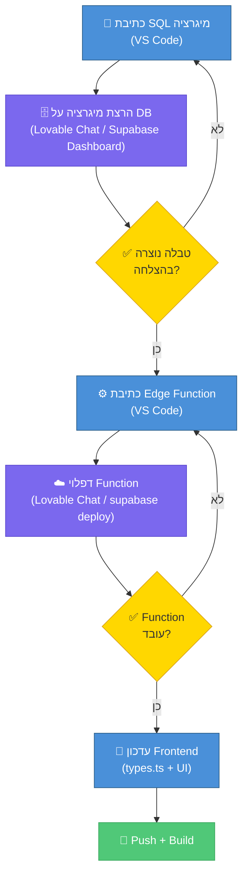

---

## שלב 1: מיגרציות DB

### מה כולל?

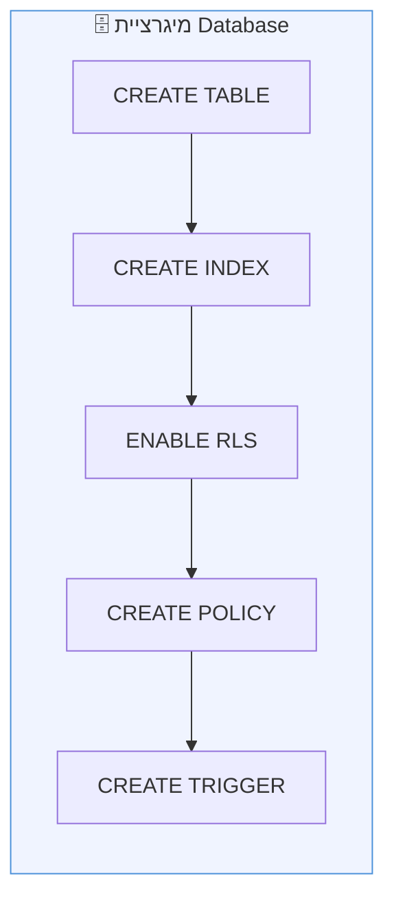

### כללים:

- ✅ **כל המיגרציות הקשורות ביחד** — בסדר הנכון (טבלה → אינדקס → RLS)
- ✅ **שימוש ב-`IF NOT EXISTS`** — למניעת כפילויות
- ✅ **בדיקה אחרי הרצה** — וידוא שהטבלה נוצרה דרך REST API

### דוגמה:

```sql
-- מיגרציה: יצירת טבלת psak_sections
CREATE TABLE IF NOT EXISTS public.psak_sections (
    id UUID DEFAULT gen_random_uuid() PRIMARY KEY,
    psak_din_id UUID REFERENCES public.psakei_din(id) ON DELETE CASCADE,
    section_type TEXT NOT NULL,
    section_content TEXT,
    section_order INTEGER DEFAULT 0,
    created_at TIMESTAMPTZ DEFAULT now()
);

-- אינדקס
CREATE INDEX IF NOT EXISTS idx_sections_psak
    ON public.psak_sections(psak_din_id);

-- RLS
ALTER TABLE public.psak_sections ENABLE ROW LEVEL SECURITY;

-- מדיניות גישה
CREATE POLICY "Allow read access"
    ON public.psak_sections FOR SELECT
    USING (true);
```

---

## שלב 2: Edge Functions

### תלות ב-DB

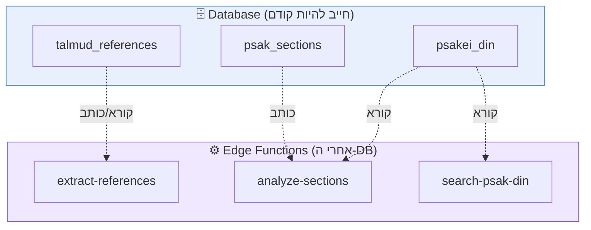

### סוגי Edge Functions:

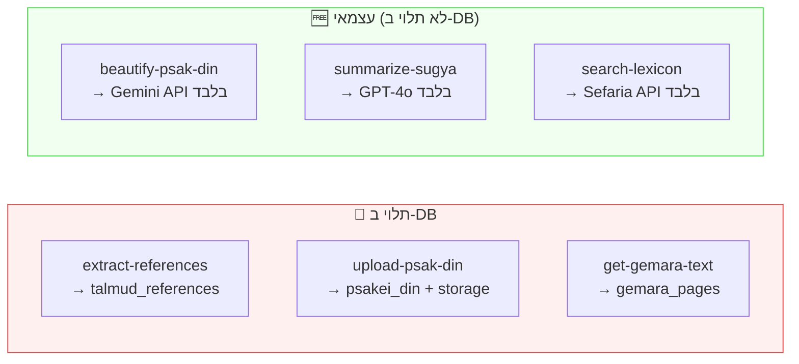

> **Functions עצמאיים** (ללא DB) — אפשר לדפלוי בכל זמן, בלי מיגרציה קודמת.

---

## שלב 3: Frontend

### זרימת העדכון:

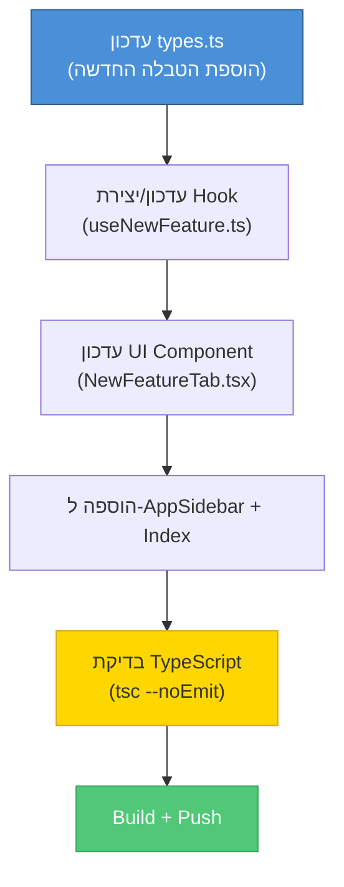

---

## מתי כן אפשר ביחד?

```mermaid
flowchart TD
    Q{"מה אתה בונה?"}
    Q -->|"Function חדש + טבלה חדשה"| S1["❌ DB קודם<br/>Function אח\"כ"]
    Q -->|"Function חדש ללא DB"| S2["✅ Function בלבד"]
    Q -->|"עמודה חדשה + Function צריך אותה"| S3["❌ DB קודם<br/>עדכון Function אח\"כ"]
    Q -->|"שינוי UI בלבד"| S4["✅ Frontend בלבד"]
    Q -->|"כמה מיגרציות קשורות"| S5["✅ כל המיגרציות ביחד"]

    style S1 fill:#ffcccc,stroke:#cc0000
    style S2 fill:#ccffcc,stroke:#00cc00
    style S3 fill:#ffcccc,stroke:#cc0000
    style S4 fill:#ccffcc,stroke:#00cc00
    style S5 fill:#ccffcc,stroke:#00cc00
```

---

## Workflow עם Lovable

### תהליך מלא:

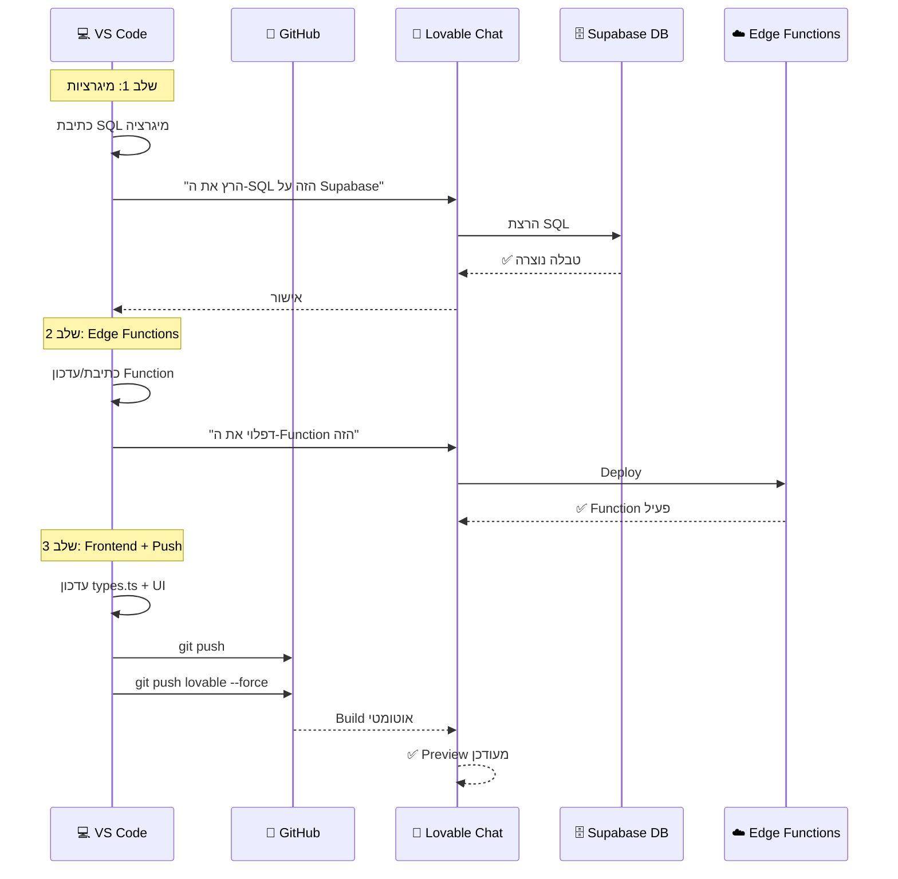

### ⚠️ זכירה חשובה — Lovable Sync חד-כיווני:

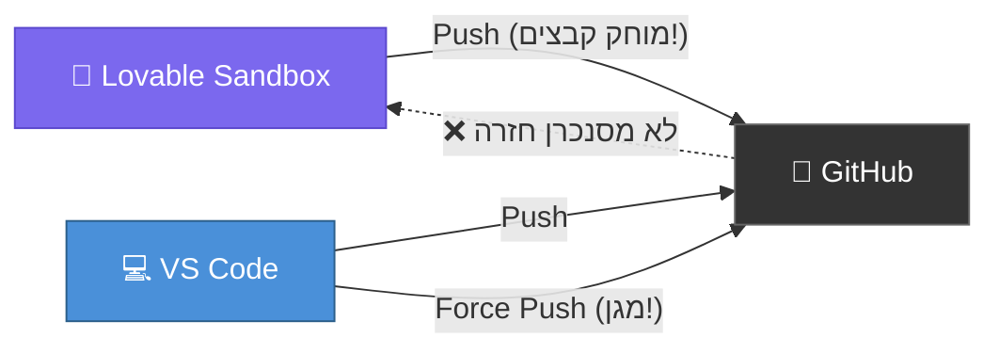

> **אחרי כל פעולה של Lovable:**
> ```powershell
> git fetch lovable
> git push lovable dev:main --force
> git push lovable dev:master --force
> ```

---

## טבלת החלטות מהירה

| מצב | DB? | Function? | Frontend? | סדר |
|---:|:---:|:---:|:---:|---:|
| פיצ'ר חדש עם טבלה | ✅ | ✅ | ✅ | DB → Function → Frontend |
| API wrapper (ללא DB) | ❌ | ✅ | ✅ | Function → Frontend |
| שינוי עיצוב בלבד | ❌ | ❌ | ✅ | Frontend בלבד |
| הוספת אינדקס | ✅ | ❌ | ❌ | DB בלבד |
| עמודה חדשה + API | ✅ | ✅ | ✅ | DB → Function → Frontend |
| תיקון באג ב-Function | ❌ | ✅ | ❌ | Function בלבד |

---

## דוגמאות מהפרויקט

### דוגמה 1: הוספת מערכת הפניות תלמודיות

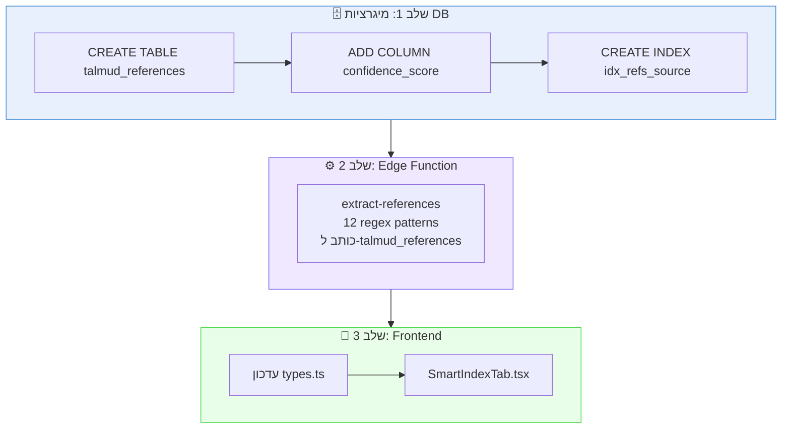

### דוגמה 2: שמירה אוטומטית לגמרא

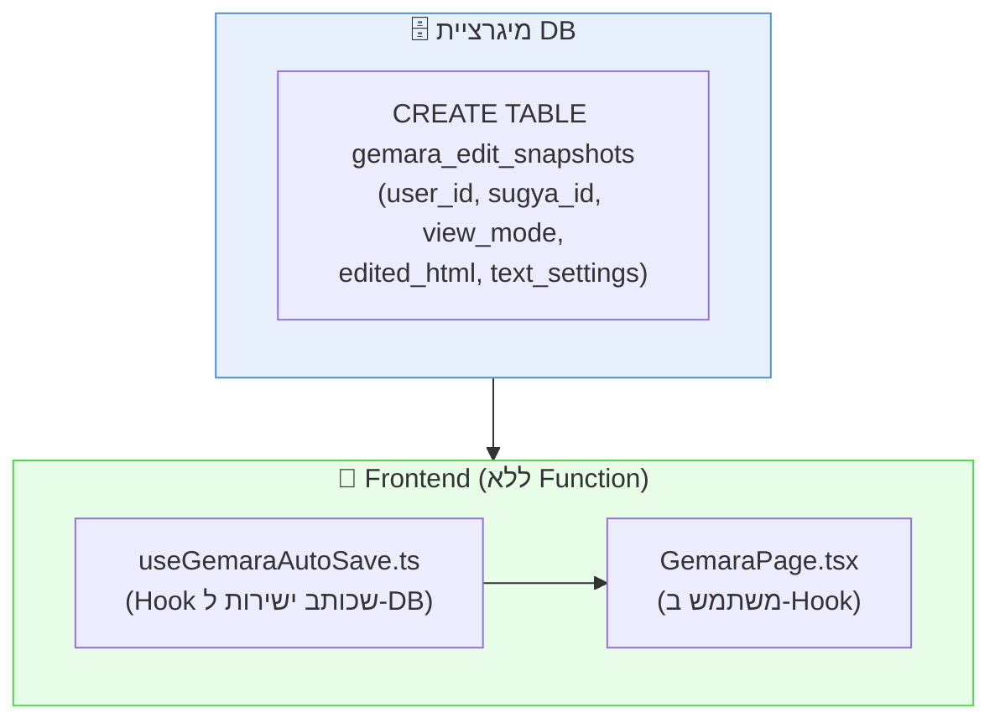

> 💡 **שים לב:** לפעמים לא צריך Edge Function! אם הקליינט כותב ישירות לDB דרך Supabase SDK — מספיק מיגרציה + Frontend.

### דוגמה 3: יפוי פסקי דין (ללא DB)

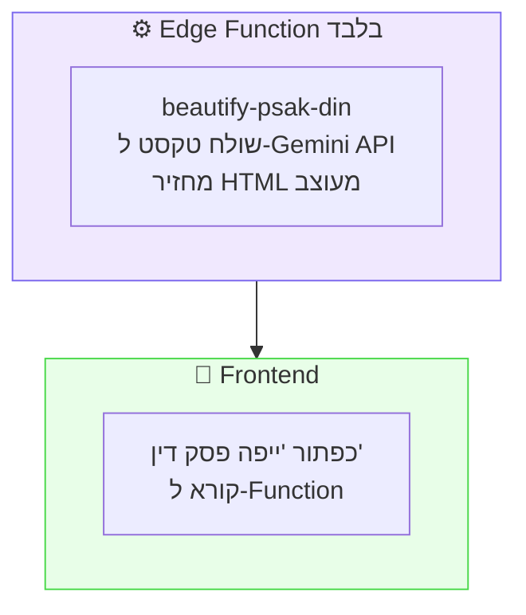

> 💡 **Function שלא כותב ל-DB** — אפשר לדפלוי בלי מיגרציה.

---

## שגיאות נפוצות

### ❌ שגיאה 1: Function לפני DB

```
ERROR: relation "talmud_references" does not exist
```

**פתרון:** הריצו את המיגרציה קודם.

### ❌ שגיאה 2: Types לא מעודכנים

```typescript
// אם types.ts לא כולל את הטבלה החדשה:
Property 'psak_sections' does not exist on type 'Database["public"]["Tables"]'
```

**פתרון:** עדכנו `types.ts` אחרי יצירת הטבלה.

### ❌ שגיאה 3: Lovable מוחק קבצים

```
2321 files deleted by Lovable push
```

**פתרון:** תמיד `force push` חזרה אחרי Lovable.

---

## סיכום ויזואלי

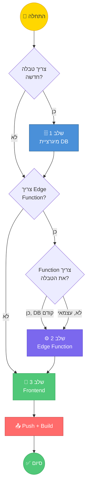

---

> **📌 כלל הזהב:** `DB → Edge Functions → Frontend` — תמיד בסדר הזה, אלא אם אין תלות.

</div>
